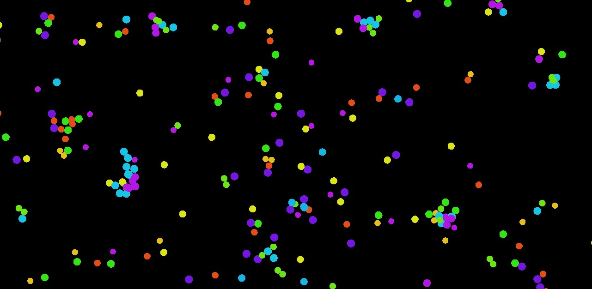

# Particle Life

A particle simulation inspired by [code parade's video](https://www.youtube.com/watch?v=Z_zmZ23grXE)

## Building And Running

Clone this repository and run `cargo run` inside of it

## Goals

I wanted to make a pretty particle simulation that would exhibit varied complex behaviour
based on random initialized parameters.

At the end, the behaviour is not very interestin but I learned a lot while working
on this project, and next time I will probably use more fitting tools like Unity.

